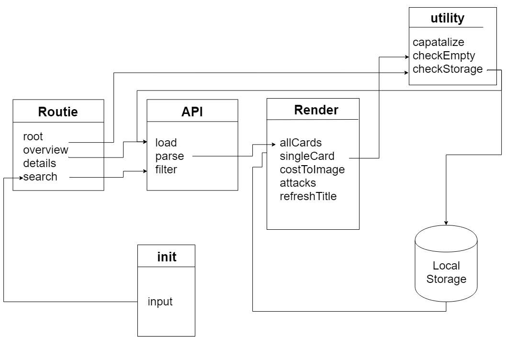

# Web app with Pokémon TCG api

This is a webapp that uses the [Pokémon TCG developers API](https://pokemontcg.io/) to load in all info about a Pokémon Trading Card and show its content HTML. It gives you the ability to search through the entire Pokémon TCG Database and

---

## Table of Contents

- [Live demo](#Live-demo)
- [Features](#Features)
  - [Searching](#Searching)
  - [Upcomming features](#Upcomming-features)
- [Functionality](#Functionality)
  - [Actor Diagram](#actor-diagram)
  - [Flow Diagram](#flow-diagram)
  - [Code snippets](#code-snippets)
- [Personal Progression](#Progression)
  - [Best practices](#Best-practices)
  - [Things I have learned](#Things-I-have-learned)
  - [Have yet to learn](#have-yet-to-learn)

---

## Live demo

[You can find the Live Demo here.](https://daoneandonly.github.io/web-app-from-scratch-18-19/public/index.html)

## Features

### Searching

The app starts with the API request for the set `sm9` (which is Sun & Moon 9, the most recent released set). With the input field you can search within that set for individual cards by name.

### Current features

- [x] Requesting a set instead of a single cards
- [x] Changing requested set and cards through input field
- [x] Adding search functionality through names
- [x] Adding routing to go from set view to single card

### Upcomming features

- [ ] Adding search functionality through multiple fields (Name, attack, type)
- [ ] Changing sets through a dropdown or overview
- [ ] Searching through the entire database by name
- [ ] Show other cards by the same name in the detail page

---

## Functionality

### Actor Diagram

The following diagram shows the workings of my application in a simplified manner. It shows how different parts of code interact with each other.

### Flow Diagram

`Pending image`

### Code snippets

Here are some snippets to see how the code actually works

- [How a single card gets rendered](docs/code-examples.md#single-card)
- [How attacks gets rendered](docs/code-examples.md#attacks)
- [How cost of an attack gets rendered](docs/code-examples.md#Cost-to-Image)

### Planned refactors

- [x] Using `map()` instead of `forEach()` to loop through template literals
- [x] Using `promise` instead of `XMLHttpRequest`
- [ ] Use a different route for a every search entry
- [ ] Using Local storage to limit the amount of API requests needed

---

## Progression

### Best practices

I have learned to use the following best practices

- [x] Using arrow functions consistently throughout my project
- [x] Using an IIFE to section of certain parts of code
- [x] Using a ternary operator instead of short if statements
- [x] Using Object literals to group bits of code and make it more readable

### Things I have learned

Here is a list of the things I have either never used or wasn't familiar with and had to use/master during this course:

- [x] Opening, receiving data with the use of an `XMLHttpRequest`
- [x] Using incomming data in JSON and manipulating it
- [x] Using template literals to export HTML with variables
- [x] Using a sprite and making use of it through js templating
- [x] Using `new Promise` to get a GET request [(as demonstrated here)](https://codepen.io/Pantheratnight/pen/KJRVeQ)
- [x] Returning that new Promise as variable so I can give it some data
- [x] Using `map()` to iterate over data
- [x] Using `filter()` to filter and sort incoming JSON

### Have yet to learn

- [ ] Using `fetch` to call an API GET request

<!--
# Web App From Scratch @cmda-minor-web 18-19

## Leerdoelen
- _Je kan structuur aanbrengen in je code door patterns toe te passen. Je kan de keuze voor de gekozen patterns beargumenteren_
- _Je kan data ophalen, manipuleren en dynamisch omzetten naar html elementen mbv templating._
- _Je begrijpt hoe je middels asynchrone code met een externe API kan werken._
- _Je begrijpt hoe je states in je applicaties kan managen en stelt de gebruiker op de hoogte van states waar nodig._

[Rubric](https://docs.google.com/spreadsheets/d/e/2PACX-1vTjZGWGPC_RMvTMry8YW5XOM79GEIdgS7I5JlOe6OeeOUdmv7ok1s9jQhzojNE4AsyzgL-jJCbRj1LN/pubhtml?gid=0&single=true)

## Lesprogramma

### Week 1 - Hello API 🐒

Doel: Data ophalen uit een API en renderen in een overzichtspagina.

[Opdrachten](https://drive.google.com/open?id=1OVhWQNaCgSluYviTKKWcApkyPd23xow1PiExb8GYANM)

[Slides](https://drive.google.com/open?id=1Rjl9xqXoKniQSRJPdkU1O5YwWC33SJK8KiV0a-H_xZU)

### Week 2 - Design and Refactor 🛠

Doel: Breakdown maken van de web app. Routes en states toevoegen. Detailpagina renderen.

[Opdrachten](https://drive.google.com/open?id=1GMDTdW3LycAYpZSFI6gk_lrKrx8-zLWrNh69aaVEH5Y)

[Slides](https://drive.google.com/open?id=1IqQeu1m0dQiSC_KCvrn8eencAgtYe7X6qT-gm0n9Bmc)

### Week 3 - Wrapping up 🎁

Doel: Data manipuleren. Code splitsen in modules. Reflecteren op eindresultaat.

[Opdrachten](https://drive.google.com/open?id=13pKQu72pshaEzKw9q5JHLa-aop85nMP6nDCdqioWjoQ)

[Slides](https://drive.google.com/open?id=1BSzGYNLMgtHD4HRnK7f0DgyTv4Pg3xsQwD_eYNo7v0Y)
 -->

<!-- Add a link to your live demo in Github Pages 🌐-->

<!-- ☝️ replace this description with a description of your own work -->

<!-- Add a nice image here at the end of the week, showing off your shiny frontend 📸 -->

<!-- Maybe a table of contents here? 📚 -->

<!-- How about a section that describes how to install this project? 🤓 -->

<!-- ...but how does one use this project? What are its features 🤔 -->

<!-- What external data source is featured in your project and what are its properties 🌠 -->

<!-- Maybe a checklist of done stuff and stuff still on your wishlist? ✅ -->

<!-- How about a license here? 📜 (or is it a licence?) 🤷 -->
