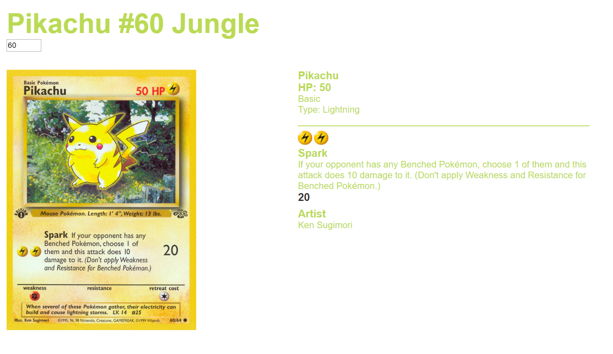
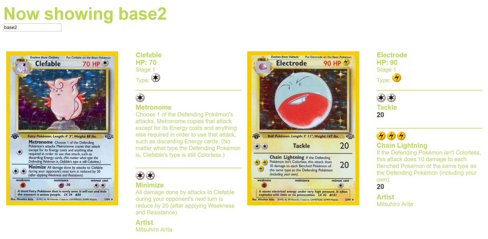

# Web App with Pokémon TCG api

I'm using the [Pokémon TCG developers API](https://pokemontcg.io/) to load in info about The Pokémon Trading Card in JSON and show its content HTML.


My single iteration showed only a single card.


In the current version the site renders a list with multiple cards.


## Live demo

[You can find the Live Demo here.](https://daoneandonly.github.io/web-app-from-scratch-18-19/week1/index.html)

## Functionality

Earlier this week I started my concept as a single card page. It renders the card as following:

```js
<section class="card">
  <section class='left half'>
    
  </section>
  <section class='right half'>
    <section class='name'>
      <h3>${data.name}</h3>
      <h3>HP: ${data.hp}</h3>
      <p>${data.subtype}</p>
      <p>Type: ${ costToImage(data.types)}</p>
    </section>
    <section class='attack'>
      ${renderAttacks(data.attacks)}
    </section>
    <section>
      <h3>Artist</h3>
      <p>${data.artist}</p>
    </section>
  </section>
</section>
```


In the `<section class="attack">` element, the individual attacks gets rendered with the `renderAttacks()` function.

```js
function renderAttacks(attacks) {
  var listOfAttacks = ''
  if (attacks != undefined){
  attacks.forEach(function(attack) {
    listOfAttacks +=
      `<section class='singleAttack'>
        ${costToImage(attack.cost)}
        <h3>${attack.name}</h3>
        <p>${attack.text}</p>
        <h3 class='damage'>${attack.damage}</h3>
      </section>`
    })
  }
```

In the `costToImage()` function it renders the value that comes out of `data.cards.attacks` as an empty `<i>` element with the type as a class.

```js
function costToImage(cost){
  if (cost === undefined){return}
  var totalCost = ''
  cost.forEach(function(element) {
    totalCost +=
    `<i class='energy ${element.toLowerCase()}'></i>`
  })
  return totalCost
}
```


# Features

### Input change

Currently, the app starts with the API request for the card `base2-60`. With the number input field you change the `currentNumber` variable that changes the card which gets requested. It still uses the set `base2-`. An eventListener is set on change on the number input field.

### Type Symbol Spriting

The app uses a sprite to render the image of any type symbol. The `costToImage(lightning)` function renders

```html
<i class='energy lightning'>
```
where lightning corresponds to the sprite class in css.


## Planned features

- [x] Requesting a set instead of a single cards
- [x] Changing requested set and cards through input field


- [ ] Adding routing to go from set view to single card
- [ ] Adding search functionality through names
- [ ] Adding search functionality through types

## Planned refactor

- [ ] Using `map()` instead of `forEach()` to loop through template literals
- [ ] Using `promise` instead of  `XMLHttpRequest`
