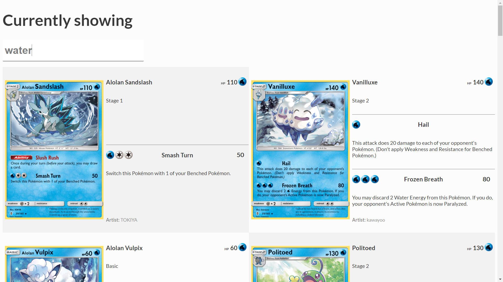

# Web App with Pokémon TCG api

I'm using the [Pokémon TCG developers API](https://pokemontcg.io/) to load in info about The Pokémon Trading Card in JSON and show its content HTML.

## Live demo

[You can find the Live Demo here.](https://daoneandonly.github.io/web-app-from-scratch-18-19/week1/index.html)
